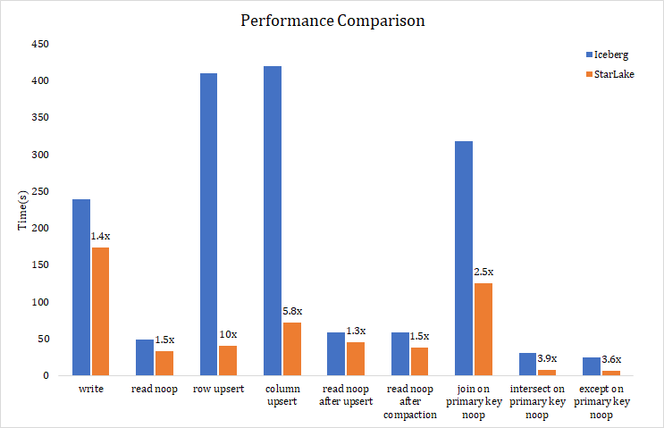

# Star Lake
Star Lake is a data lake storage solution built on top of the Apache Spark engine by the EnginePlus team, that supports scalable metadata management, ACID transactions, efficient and flexible upsert operation, schema evolution, and streaming & batch unification.

Star Lake specializes in row and column level incremental upserts, high concurrent write, and bulk scan for data on cloud storage. The cloud native computing and storage separation architecture makes deployment very simple, while supporting huge amounts of data at lower cost.  
To be specific, Star Lake has the following characteristics:
  - Elastic framework: The computing and storage is completely separated. Without the need for fixed nodes and disks, the computing and storage has its own elastic capacity, and a lot of optimization for the cloud storage has done, like concurrency consistency in the object storage, incremental update and etc. With Star Lake, there is no need to maintain fixed storage nodes, and the cost of object storage on cloud is only 1/10 of local disk, which greatly reduces storage and operation costs.
  - Efficient and scalable metadata management: Star Lake uses Cassandra to manage metadata, which can efficiently handle modification on metadata and support multiple concurrent writes. It solves the problem of slow metadata parsing after long running in data Lake systems such as Delta Lake which use files to maintain metadata, and can only be written at a single point.
  - ACID transactions: Undo and Redo mechanism ensures that the committing are transactional and users will never see inconsistent data. 
  - Multi-level partitioning and efficient upsert: Star Lake supports range and hash partitioning, and a flexible upsert operation at row and column level. The upsert data are stored as delta files, which greatly improves the efficiency and concurrency of writing data, and the optimized merge scan provides efficient MergeOnRead performance.
  - Streaming and batch unification: Streaming Sink is supported in Star Lake, which can handle streaming data ingesting, historical data filling in batch, interactive query and other scenarios simultaneously.
  - Schema evolution: Users can add new fields at any time and quickly populate the new fields with historical data.
  
Scenario of Star Lake:
  - Incremental data need to be written efficiently in large batches in real time, as well as concurrent updates at the row or column level.
  - Detailed query and update on a large time range with huge amount historical data, while hoping to maintain a low cost
  - The query is not fixed, and the resource consumption changes greatly, which is expected that the computing resources can be flexible and scalable independently
  - High concurrent writes are required, and metadata is too large for Delta Lake to meet performance requirements.
  - For data updates to primary keys, Hudi's MergeOnRead does not meet update performance requirements.


# Comparison of Data Lake Solutions
|   | Delta Lake | Hudi | Iceberg | Star Lake |
| ----- | :----- | :----- | :----- | :----- | 
| Table Mode | CopyOnWrite | CopyOnWrite and MergeOnRead | only delete supports MergeOnRead | **CopyOnWrite and MergeOnRead** |
| Metadata Store | meta files on table path | meta files on table path | meta files on table path | **Cassandra** |
| Metadata Scalability | low | low | low | **high** |
| Read | partition pruning by meta files | partition pruning by meta files | metadata is richer and supports fine-grained pruning at file level | **partition pruning by meta data** |
| Concurrent Write | support | only support one writer，optimistic concurrency is still in the experimental stage | support | **support, the unique upsert mechanism turns updates into append, greatly improved concurrent write performance** |
| Streaming and Batch Unification | support | don't support concurrent write | support | **support** |
| Row Level Upsert | overwrite row-related files | support MergeOnRead，will be compacted at next snapshot | overwrite row-related files | **support MergeOnRead，only write the data to be updated** |
| Column Level upsert | overwrite all files in partition | support MergeOnRead，will overwrite all files in the partition at next snapshot | overwrite all files in partition | **support MergeOnRead，can last any time until user executes compaction, and optimized merge scan provides efficient read performance** |
| Bucket Join | nonsupport | nonsupport | nonsupport，bucket rules can be specified in partitioning spec, but there is no implementation yet | **support** |


# Performance Comparison Between Star Lake and Iceberg
In above data Lake solutions, Delta Lake open source version exists to feed commercial version, and the community is inactive. Hudi focuses on the streaming scenario, and does not support concurrent write, as a data lake solution, the application scenario is too narrow. Iceberg, with its elegant abstract design and active community, as well as more and more new features as the version is updated, is one of the best data lake solution at present, so we choose Iceberg to compare performance.



# Introduce Dependencies
```xml
<dependency>
    <groupId>com.engineplus</groupId>
    <artifactId>star-lake</artifactId>
    <version>1.0.0</version>
</dependency>
```

# Usage

## 1. Create and Write StarTable

### 1.1 Table Name

The table name in Star Lake is a path, and the path where the data is stored is the table name.

When the Dataframe.write(or writeStream) is called to write data to StarTable, a new table will automatically created using the storage path if the table does not exist.


### 1.2 Metadata Management
Star Lake manages metadata through cassandra, so it can process metadata efficiently and meta clusters can be easily scaled up in the cloud.

You need to specify the cassandra cluster address when you use it, which can be configured into the spark environment or can be specified when the job is running.


### 1.3 Partition
StarTable can be partitioned in two ways, range and hash, and both can be used at the same time.
  - Range partition is a common time-based table partition. Data files of different partitions are stored in different partition paths.
  - To use a hash partition, you must specify both the hash primary key field and the hash bucket num. The hash bucket num is used to hash the hash primary key field in the hash partition.
  - If you specify a range partition and a hash partition, each range partition will have the same hash value written to the same file.
  - When partitioning is specified, data written to StarTable must contain partitioning fields.

Depending on the specific scenario, you can choose to use a range partition, a hash partition, or both. When a hash partition is specified, the data in StarTable will be unique by the primary key, which is the hash partition field + range partition field (if any).

StarTable supports the upsert operation only if the hash partition is specified.

### 1.4 Code Examples
```scala
import org.apache.spark.sql._
val spark = SparkSession.builder.master("local")
  //cassandra host
  .config("spark.engineplus.star.meta.host", "cassandra_host")
  .config("spark.sql.extensions", "com.engineplus.star.sql.StarSparkSessionExtension")
  .getOrCreate()
import spark.implicits._

//spark batch
val df = Seq(("2021-01-01",1,"rice"),("2021-01-01",2,"bread")).toDF("date","id","name")
val tablePath = "s3a://bucket-name/table/path/is/also/table/name"
df.write
  .mode("append")
  .format("star")
  .option("rangePartitions","date")
  .option("hashPartitions","id")
  .option("hashBucketNum","2")
  .save(tablePath)

//spark streaming
import org.apache.spark.sql.streaming.Trigger
val readStream = spark.readStream.parquet("inputPath")
val writeStream = readStream.writeStream
  .outputMode("append")
  .trigger(Trigger.ProcessingTime("1 minutes"))
  .format("star")
  .option("rangePartitions","date")
  .option("hashPartitions","id")
  .option("hashBucketNum", "2")
  .option("checkpointLocation", "s3a://bucket-name/checkpoint/path")
  .start(tablePath)
writeStream.awaitTermination()
```

## 2. Read StarTable
The data can be read through the Spark Read API or by building Startable. Star Lake also supports reading data through Spark SQL, see [8. Use Spark SQL On StarTable](#8-Use Spark SQL On StarTable)

### 2.1 Code Examples
```scala
import org.apache.spark.sql._
val spark = SparkSession.builder.master("local")
  .config("spark.engineplus.star.meta.host", "cassandra_host")
  .config("spark.sql.extensions", "com.engineplus.star.sql.StarSparkSessionExtension")
  .getOrCreate()
val tablePath = "s3a://bucket-name/table/path/is/also/table/name"


val df1 = spark.read.format("star").load(tablePath)


import com.engineplus.star.tables.StarTable
val df2 = StarTable.forPath(tablePath).toDF

```

## 3. Upsert StarTable

### 3.1 Batch
Upsert functionality is supported when Startable uses hash partitioning.

By default, using MergeonRead mode, upsert data is written to the table path in the form of a delta file, and Star Lake provides efficient upsert and Merge Scan performance.

Parameters can be set by the spark. Engineplus. Star. DeltaFile. Enabled to false CopyOnWrite open mode, each upsert generated eventually merge data, but is not recommended, because writing efficiency is very poor and concurrent degree is low.


#### 3.1.1 Code Examples
```scala
import com.engineplus.star.tables.StarTable
import org.apache.spark.sql._
val spark = SparkSession.builder.master("local")
  .config("spark.engineplus.star.meta.host", "cassandra_host")
  .config("spark.sql.extensions", "com.engineplus.star.sql.StarSparkSessionExtension")
  .getOrCreate()
import spark.implicits._

val tablePath = "s3a://bucket-name/table/path/is/also/table/name"

val starTable = StarTable.forPath(tablePath)
val extraDF = Seq(("2021-01-01",3,"chicken")).toDF("date","id","name")

starTable.upsert(extraDF)
```

### 3.2 Streaming
In a streaming scenario, if OutputMode is complete, each write will overwrite the previous data.

When outputMode is APPEND or UPDATE, if a hash partition is specified, each write is treated as an upsert update, and if data with the same primary key exists at read time, the latest value of the same field overrides the previous value. Update OutputMode is available only if the hash partition is specified.
Duplicate data is allowed if no hash partitioning is used.
  

## 4. Update StarTable
Star Lake supports update operations, which are performed by specifying the condition and the field Expression that needs to be updated. There are several ways you can perform the update, see the com engineplus. Star. Name StarTable annotations.


### 4.1 Code Examples
```scala
import com.engineplus.star.tables.StarTable
import org.apache.spark.sql._
val spark = SparkSession.builder.master("local")
  .config("spark.engineplus.star.meta.host", "cassandra_host")
  .config("spark.sql.extensions", "com.engineplus.star.sql.StarSparkSessionExtension")
  .getOrCreate()

val tablePath = "s3a://bucket-name/table/path/is/also/table/name"
val starTable = StarTable.forPath(tablePath)
import org.apache.spark.sql.functions._

//update(condition, set)
starTable.update(col("date") > "2021-01-01", Map("data" -> lit("2021-01-02")))

```

## 5. Delete Data

### 5.1 Code Examples
```scala
import com.engineplus.star.tables.StarTable
import org.apache.spark.sql._
val spark = SparkSession.builder.master("local")
  .config("spark.engineplus.star.meta.host", "cassandra_host")
  .config("spark.sql.extensions", "com.engineplus.star.sql.StarSparkSessionExtension")
  .getOrCreate()

val tablePath = "s3a://bucket-name/table/path/is/also/table/name"
val starTable = StarTable.forPath(tablePath)


starTable.delete("date='2021-01-01'")

starTable.delete()
```

## 6. Compaction

### 6.1 Code Examples
```scala
import com.engineplus.star.tables.StarTable
import org.apache.spark.sql._
val spark = SparkSession.builder.master("local")
  .config("spark.engineplus.star.meta.host", "cassandra_host")
  .config("spark.sql.extensions", "com.engineplus.star.sql.StarSparkSessionExtension")
  .getOrCreate()

val tablePath = "s3a://bucket-name/table/path/is/also/table/name"
val starTable = StarTable.forPath(tablePath)

starTable.compaction("date='2021-01-01'")
starTable.compaction()
starTable.compaction(false)

```

## 7. Cleanup

### 7.1 Code Examples
```scala
import com.engineplus.star.tables.StarTable
import org.apache.spark.sql._
val spark = SparkSession.builder.master("local")
  .config("spark.engineplus.star.meta.host", "cassandra_host")
  .config("spark.sql.extensions", "com.engineplus.star.sql.StarSparkSessionExtension")
  .getOrCreate()

val tablePath = "s3a://bucket-name/table/path/is/also/table/name"
val starTable = StarTable.forPath(tablePath)

starTable.cleanup()
```

## 8. Use Spark SQL On StarTable

### 8.1 Code Examples
```scala
import com.engineplus.star.tables.StarTable
import org.apache.spark.sql._
val spark = SparkSession.builder.master("local")
  .config("spark.engineplus.star.meta.host", "cassandra_host")
  .config("spark.sql.extensions", "com.engineplus.star.sql.StarSparkSessionExtension")
  .config("spark.sql.catalog.spark_catalog", "org.apache.spark.sql.star.catalog.StarLakeCatalog")
  .getOrCreate()

val tablePath = "s3a://bucket-name/table/path/is/also/table/name"
spark.range(10).createOrReplaceTempView("tmpView")

spark.sql(s"insert into table star.`$tablePath` select * from tmpView")

spark.sql(s"select * from star.`$tablePath`").show()

```

## 9. Operator on Hash Primary Keys

### 9.1 Join on Hash Keys


### 9.2 Intersect/Except on Hash Keys


### 9.3 Code Examples
```scala
import org.apache.spark.sql._
val spark = SparkSession.builder.master("local")
  .config("spark.engineplus.star.meta.host", "cassandra_host")
  .config("spark.sql.extensions", "com.engineplus.star.sql.StarSparkSessionExtension")
  .config("spark.sql.catalog.spark_catalog", "org.apache.spark.sql.star.catalog.StarLakeCatalog")
  .getOrCreate()
import spark.implicits._


val df1 = Seq(("2021-01-01",1,1,"rice"),("2021-01-02",2,2,"bread")).toDF("date","id1","id2","name")
val df2 = Seq(("2021-01-01",1,1,2.7),("2021-01-02",2,2,1.3)).toDF("date","id3","id4","price")

val tablePath1 = "s3a://bucket-name/table/path/is/also/table/name/1"
val tablePath2 = "s3a://bucket-name/table/path/is/also/table/name/2"

df1.write
  .mode("append")
  .format("star")
  .option("rangePartitions","date")
  .option("hashPartitions","id1,id2")
  .option("hashBucketNum","2")
  .save(tablePath1)
df2.write
  .mode("append")
  .format("star")
  .option("rangePartitions","date")
  .option("hashPartitions","id3,id4")
  .option("hashBucketNum","2")
  .save(tablePath2)


spark.sql(
  s"""
    |select t1.*,t2.* from
    | (select * from star.`$tablePath1` where date='2021-01-01') t1
    | join 
    | (select * from star.`$tablePath1` where date='2021-01-02') t2
    | on t1.id1=t2.id1 and t1.id2=t2.id2
  """.stripMargin)
    .show()

spark.sql(
  s"""
    |select t1.*,t2.* from
    | (select * from star.`$tablePath1` where date='2021-01-01') t1
    | join 
    | (select * from star.`$tablePath2` where date='2021-01-01') t2
    | on t1.id1=t2.id3 and t1.id2=t2.id4
  """.stripMargin)
  .show()

//intersect/except on hash keys without shuffle,sort and distinct

spark.sql(
  s"""
    |select count(1) from 
    | (select id1,id2 from star.`$tablePath1` where date='2021-01-01'
    |  intersect
    | select id1,id2 from star.`$tablePath1` where date='2021-01-02') t
  """.stripMargin)
  .show()

spark.sql(
  s"""
    |select count(1) from 
    | (select id1,id2 from star.`$tablePath1` where date='2021-01-01'
    |  intersect
    | select id3,id4 from star.`$tablePath2` where date='2021-01-01') t
  """.stripMargin)
  .show()

```

## 10. Schema Evolution

### 10.1 Merge Schema

### 10.2 Code Examples
```scala
df.write
  .mode("append")
  .format("star")
  .option("rangePartitions","date")
  .option("hashPartitions","id")
  .option("hashBucketNum","2")

  .option("mergeSchema","true")
  .save(tablePath)
  
val spark = SparkSession.builder.master("local")
  .config("spark.engineplus.star.meta.host", "cassandra_host")
  .config("spark.sql.extensions", "com.engineplus.star.sql.StarSparkSessionExtension")

  .config("spark.engineplus.star.schema.autoMerge.enabled", "true")
  .getOrCreate()
```

## 11. Drop Partition


### 11.1 Code Examples
```scala
import com.engineplus.star.tables.StarTable
import org.apache.spark.sql._
val spark = SparkSession.builder.master("local")
  .config("spark.engineplus.star.meta.host", "cassandra_host")
  .config("spark.sql.extensions", "com.engineplus.star.sql.StarSparkSessionExtension")
  .getOrCreate()

val tablePath = "s3a://bucket-name/table/path/is/also/table/name"
val starTable = StarTable.forPath(tablePath)


starTable.dropPartition("date='2021-01-01'")

```

## 12. Drop Table


### 12.1 Code Examples
```scala
import com.engineplus.star.tables.StarTable
import org.apache.spark.sql._
val spark = SparkSession.builder.master("local")
  .config("spark.engineplus.star.meta.host", "cassandra_host")
  .config("spark.sql.extensions", "com.engineplus.star.sql.StarSparkSessionExtension")
  .getOrCreate()

val tablePath = "s3a://bucket-name/table/path/is/also/table/name"
val starTable = StarTable.forPath(tablePath)


starTable.dropTable()

```